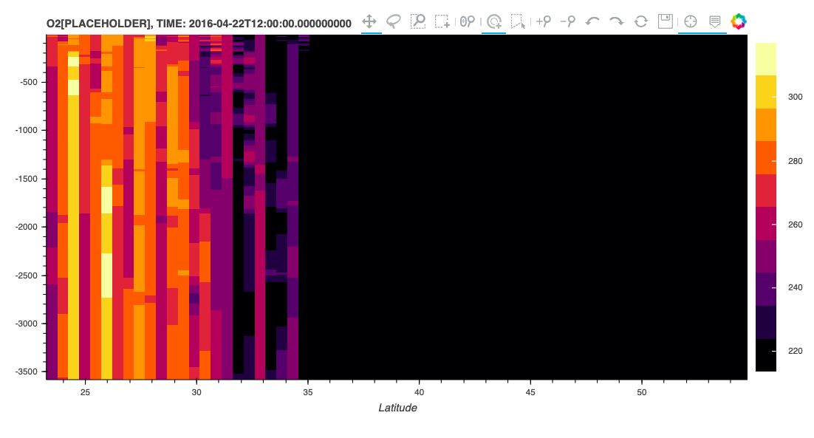
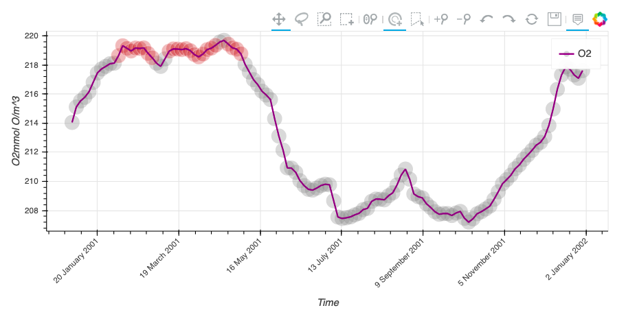

# CS510 Plotting Examples

# [Regional Map](https://veerg24.github.io/myonlinebook/03/regionalmap.html)

# [Histogram](https://veerg24.github.io/myonlinebook/03/histogram.html)

# [Sectional Map](https://veerg24.github.io/myonlinebook/03/sectionalmap.html)

# [Time Series](https://veerg24.github.io/myonlinebook/03/timeseries.html)
