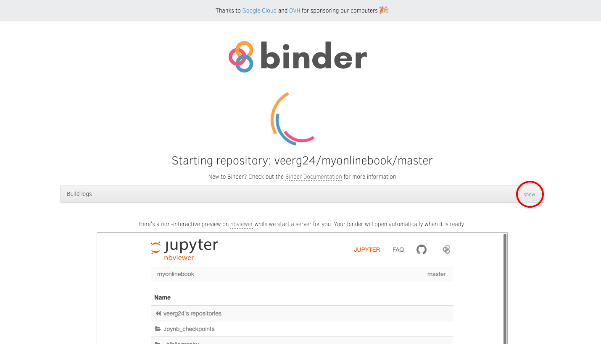

# About the Interactive Book

This online book is made using Jupyter Books and comprises of a collection of Jupyter Notebook and Markdown files. This allows users to interact with and modify the code on each of the pages. Watch the video below, or follow the steps to see how.

## Video
<video width="900px" id="sampleMovie" src="jupyterbook.mp4" controls></video>

## Steps to Interact with the Code

1. Click on the 'Interact' button at the top of the page. This will take you to a binder.

2. You can click on show logs to view the processing. This entire process may take up to a couple of minutes. This will automatically take you to JupyterLab. 

3. You can view all the files of this online textbook and their respective code on this platform. To run the code, click on 'Run', and then 'Run All Cells' and there you go!
